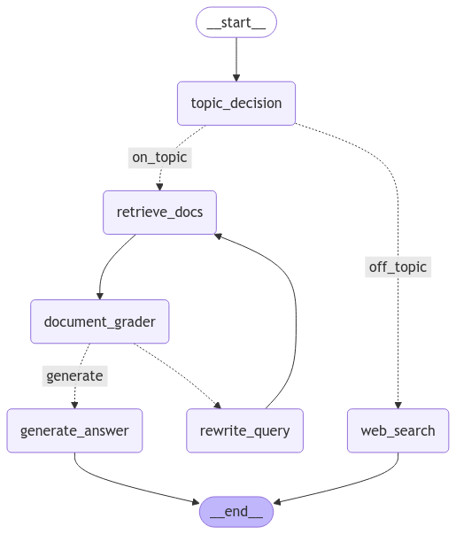

# Agentic RAG Medical Assistant

Built an advanced medical assistant chatbot using a fine-tuned LLaMA-3.1-8B model and a Retrieval-Augmented Generation (RAG) pipeline with intelligent agent functionality.

- **RAG Architecture**:
  


- **Agentic RAG Workflow**:



## Features

- **History-Aware Responses**: Provides precise medical advice by integrating over **20+ medical resources** through a RAG pipeline.
- **Intelligent Query Routing**: Implemented agents to dynamically route off-topic queries to web search (e.g., Wikipedia) and process on-topic queries through document retrieval pipelines.
- **Document Relevance Grading**: Graded retrieved documents for relevance, generating responses if relevant or rewriting queries for improved retrieval.
- **Fine-Tuned LLaMA Model**: Fine-tuned **LLaMA 3.1 8B** using **LoRA**, achieving a **0.29 ROUGE1 score** for accuracy and reliability.
- **Low-Latency Interface**: Built an asynchronous chat interface with **FastAPI**, reducing response latency by **40%** for a seamless user experience.

---

## Tech Stack

### 1. Language Model

- **LLaMA 3.1 (8B)** fine-tuned on **medical conversational datasets** using **PEFT (LoRA)** for domain-specific expertise.
- **Unsloth**: Accelerated fine-tuning with **4-bit quantization**, reducing resource usage without compromising performance.
  ```bash
  https://GitHub.com/unslothai/unsloth.git
  ```
- **Ollama**: Used for model integration and serving.

### 2. RAG Pipeline

- **LangChain**: Enabled context-aware responses and integrated the LLaMA model with document retrieval capabilities.
- **ChromaDB**: Stored and retrieved embeddings for efficient and accurate responses.

### 3. Backend

- **FastAPI**: Provided a robust and asynchronous backend for a seamless chat interface.

### 4. Other Tools

- **Hugging Face**: Hosted and served the optimized model in **GGUF format** for efficient inference.

---

## Setup Instructions

1. **Clone the Repository**

   ```bash
   git clone https://github.com/SathvikNayak123/Agentic-RAG.git
   ```

2. **Install Dependencies**

   ```bash
   pip install -r requirements.txt
   ```

3. **Setup**

   - Populate the database with medical documents.
   - Generate and store embeddings using the fine-tuned LLaMA 3.1 model.
   - Install Ollama and pull the model from Hugging Face:
     ```bash
     ollama pull hf.co/sathvik123/llama3-ChatDoc
     ```

4. **Run the Application**

   ```bash
   uvicorn app:app --reload
   ```

---

## Results

- **Model Performance**: Achieved a **0.29 ROUGE1 score** with fine-tuned LLaMA 3.1.

- **RAG Responses**: Demonstrated accurate and history-aware conversational capabilities.


- **Agent Functionality**: Effectively routed and processed queries based on topic relevance.

